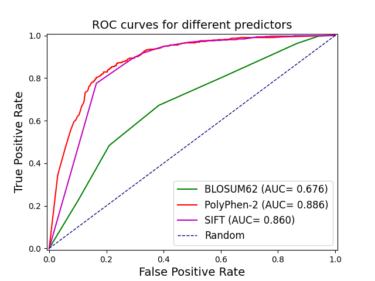

# Variant Impact Prediction Benchmarking

This repository provides tools and resources for benchmarking the performance of variant impact prediction algorithms, such as PolyPhen-2 and SIFT, using curated datasets. The goal is to assess and visualize how well these tools predict the pathogenicity of missense (nonsynonymous) mutations, which are single nucleotide changes in DNA that alter the amino acid sequence of proteins.

## Overview
- **Missense mutations** can have varying effects on protein function, from benign to disease-causing. Accurate prediction of their impact is crucial for genetic research and clinical genomics.
- **PolyPhen-2** and **SIFT** are widely used computational tools that predict the functional impact of amino acid substitutions.
- This project benchmarks these tools against a gold standard dataset with known benign and pathogenic variants, and visualizes their performance using ROC (Receiver Operating Characteristic) plots.

## Repository Structure
- `scripts/`: Python scripts for data processing, benchmarking, and ROC plot generation.
- `data/`: Reference datasets and scoring files.
- `output/`: Generated results, including ROC plots and processed data tables.

## Getting Started
1. Place your variant data and prediction scores in the `data/` directory.
2. Use the scripts in `scripts/` to process the data and generate ROC plots.
3. Results will be saved in the `output/` directory.

## Example Usage
```bash
python scripts/skeleton_script_create_roc_plot.py --input data/vep/HGVS_2020_big_polyphen_scores.tsv --output output/roc_polyphen.png
```

## Example Results

### Combined ROC Plot

Below is a combined ROC (Receiver Operating Characteristic) plot generated by this project for three predictors: SIFT, PolyPhen-2, and a BLOSUM62-based baseline. The ROC curve visualizes the trade-off between the true positive rate (sensitivity) and the false positive rate (1-specificity) for different threshold settings. The closer the curve follows the left-hand border and then the top border of the ROC space, the more accurate the test.



**Interpretation:**
- **PolyPhen-2 (AUC = 0.886)** and **SIFT (AUC = 0.860)** both show strong performance, with ROC curves that rise steeply towards the top-left, indicating high sensitivity and specificity in distinguishing pathogenic from benign variants.
- **The baseline (BLOSUM62, AUC = 0.676)** performs less well, as expected, but still provides a useful reference for comparison.
- **AUC (Area Under the Curve)** values quantify overall performance: values closer to 1.0 indicate better discrimination. Both SIFT and PolyPhen-2 perform well above a random classifier (the diagonal line).

These results demonstrate that SIFT and PolyPhen-2 are effective tools for predicting the impact of missense mutations, with performance well above a random classifier.

## Requirements
- Python 3.x
- pandas
- matplotlib

Install dependencies with:
```bash
pip install -r requirements.txt
```